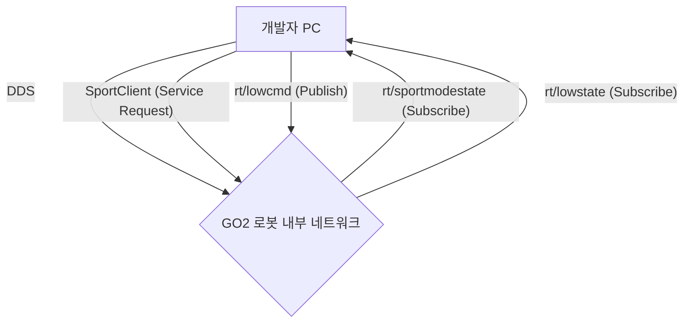

# Unitree GO2 PRO 개발자 가이드

**작성자:** Manus AI
**최종 업데이트:** 2025년 12월 23일

## 1. 개요

이 문서는 Unitree GO2 PRO 로봇을 사용하여 개발을 시작하는 개발자를 위한 종합 가이드입니다. GO2 PRO의 하드웨어 사양, 소프트웨어 아키텍처, 제어 방식 및 개발 환경 설정에 대한 상세한 정보를 제공하여 개발 과정을 용이하게 하는 것을 목표로 합니다. [1]

## 2. 하드웨어 사양

GO2 PRO는 강력한 성능과 다양한 센서를 탑재한 지능형 4족 로봇입니다. 주요 하드웨어 사양은 다음과 같습니다. [2]

### 2.1. 기계적 사양

| 항목 | 사양 |
| :--- | :--- |
| 서있는 자세 크기 | 70cm x 31cm x 40cm |
| 웅크린 자세 크기 | 76cm x 31cm x 20cm |
| 무게 (배터리 포함) | 약 15kg |
| 재질 | 알루미늄 합금 + 고강도 엔지니어링 플라스틱 |

### 2.2. 전자 파라미터

| 항목 | 사양 |
| :--- | :--- |
| 전압 | 28V ~ 33.6V |
| 최대 작동 전력 | 약 3000W |

### 2.3. 성능 파라미터

| 항목 | 사양 |
| :--- | :--- |
| 페이로드 | 약 8kg (최대 ~10kg) |
| 속도 | 0 ~ 3.5m/s |
| 최대 등반 높이 | 약 16cm |
| 최대 등반 각도 | 40° |
| 기본 컴퓨팅 파워 | 8코어 고성능 CPU |

### 2.4. 센서 및 액세서리

| 항목 | Go2 PRO |
| :--- | :--- |
| 초광각 4D LiDAR | ● (기본 탑재) |
| 무선 벡터 위치 추적 모듈 | ● (기본 탑재) |
| HD 광각 카메라 | ● (기본 탑재) |
| 발끝 힘 센서 | ○ (미탑재) |
| 수동 컨트롤러 | 옵션 |
| 스마트 배터리 | 표준 (8000mAh) |
| 배터리 수명 | 약 1-2시간 |

---

## 참고 자료

[1] Unitree Robotics. "Go2 SDK Development Guide". [https://support.unitree.com/home/en/developer/about_Go2](https://support.unitree.com/home/en/developer/about_Go2)
[2] Unitree Robotics. "Robot Dog Go2". [https://www.unitree.com/go2](https://www.unitree.com/go2)

## 3. 소프트웨어 아키텍처

GO2의 소프트웨어는 DDS(Data Distribution Service) 통신을 기반으로 한 모듈식 아키텍처를 채택하고 있습니다. 이를 통해 개발자는 로봇의 상태를 실시간으로 모니터링하고 다양한 수준의 제어 명령을 전송할 수 있습니다. [3]

### 3.1. SDK 개념

Unitree SDK는 로봇과의 통신 및 제어를 위한 인터페이스를 제공합니다. 주요 개념은 다음과 같습니다:

*   **DDS (Data Distribution Service):** OMG(Object Management Group) 표준 실시간 통신 미들웨어입니다. GO2는 DDS를 사용하여 로봇 내부의 여러 프로세스 간, 그리고 로봇과 외부 컴퓨터 간의 데이터를 교환합니다.
*   **Topic:** DDS 통신에서 데이터가 게시(publish)되고 구독(subscribe)되는 채널입니다. 각 토픽은 특정 유형의 데이터를 전달합니다 (예: `rt/lowstate`, `rt/sportmodestate`).
*   **High-Level Control (고수준 제어):** `SportClient`를 통해 로봇의 전체적인 동작(걷기, 앉기, 균형 잡기 등)을 제어합니다. 개발자는 복잡한 동역학 계산 없이 간단한 명령으로 로봇을 움직일 수 있습니다.
*   **Low-Level Control (저수준 제어):** `LowCmd` 및 `LowState`를 통해 각 모터의 위치, 속도, 토크를 직접 제어합니다. 정밀한 관절 제어가 필요할 때 사용됩니다.

### 3.2. 통신 아키텍처

GO2의 통신은 크게 두 가지 레벨로 나뉩니다. [4]

*   **High-Level Communication:** 로봇의 전체적인 상태와 스포츠 모드(고수준 동작)에 대한 데이터를 주고받습니다.
    *   **State Topic:** `rt/sportmodestate` - 로봇의 IMU, 위치, 속도 등 고수준 상태 정보를 게시합니다.
    *   **Control Service:** `SportClient` - `Move`, `StandUp`, `Sit` 등과 같은 고수준 제어 명령을 서비스 요청(Request-Reply) 방식으로 전송합니다.

*   **Low-Level Communication:** 각 관절 모터의 상세한 상태를 받고 직접 제어 명령을 내립니다.
    *   **State Topic:** `rt/lowstate` - 각 모터의 각도(q), 각속도(dq), 토크(tau) 등 저수준 상태 정보를 게시합니다.
    *   **Command Topic:** `rt/lowcmd` - 각 모터에 대한 목표 각도, 속도, 토크 등을 담은 `LowCmd` 메시지를 게시하여 제어합니다.



---

## 참고 자료

[3] Unitree Robotics. "SDK Concepts". [https://support.unitree.com/home/en/developer/SDK_Concepts](https://support.unitree.com/home/en/developer/SDK_Concepts)
[4] Unitree Robotics. "Architecture Description". [https://support.unitree.com/home/en/developer/Architecture_Description](https://support.unitree.com/home/en/developer/Architecture_Description)

## 4. 개발 환경 설정

GO2 PRO 개발을 시작하기 위해 개발자 PC와 로봇 간의 네트워크를 설정하고 필요한 SDK를 설치해야 합니다.

### 4.1. 네트워크 설정

개발자 PC와 GO2 로봇은 이더넷 케이블을 통해 연결되며, 동일한 서브넷에 있도록 네트워크 설정을 해야 합니다. [5]

1.  **IP 주소 설정:**
    *   GO2 로봇의 내장 컴퓨터는 `192.168.123.161` IP 주소를 사용합니다.
    *   개발자 PC의 이더넷 어댑터 IP 주소를 `192.168.123.x` (예: `192.168.123.222`)로 설정합니다. `x`는 161이 아닌 다른 숫자여야 합니다.

2.  **연결 확인:**
    *   터미널에서 `ping 192.168.123.161` 명령을 실행하여 로봇과의 연결을 확인합니다.

3.  **네트워크 인터페이스 확인:**
    *   `ifconfig` 또는 `ip a` 명령을 사용하여 개발자 PC에서 사용하는 네트워크 인터페이스의 이름(예: `enp2s0`, `eth0`)을 확인합니다. 이 이름은 SDK 예제 실행 시 필요합니다.

### 4.2. C++ SDK 설치

Unitree는 C++ 개발을 위한 SDK를 제공합니다. [6]

1.  **의존성 설치:**

    ```bash
    sudo apt install cmake gcc build-essential libeigen3-dev
    ```

2.  **SDK 다운로드 및 빌드:**

    ```bash
    # GitHub에서 SDK 소스 코드 다운로드
    git clone https://github.com/unitreerobotics/unitree_sdk2.git
    cd unitree_sdk2
    mkdir build
    cd build
    cmake ..
    make
    ```

3.  **예제 실행:**
    빌드가 성공하면 `build/bin` 디렉토리에 예제 실행 파일이 생성됩니다. 예를 들어, 고수준 제어 예제를 실행하려면 다음 명령을 사용합니다.

    ```bash
    ./bin/high_motion_control <your_network_interface>
    ```

### 4.3. Python SDK 설치

Python을 이용한 개발을 위해 `unitree_sdk2_python` 패키지를 제공합니다. [7]

1.  **의존성 설치:**

    ```bash
    sudo apt install python3-pip
    pip3 install numpy opencv-python
    ```

2.  **cyclonedds 설치:**
    `unitree_sdk2_python`은 `cyclonedds`에 의존합니다. 먼저 `cyclonedds`를 소스에서 빌드하고 설치해야 합니다.

    ```bash
    git clone https://github.com/eclipse-cyclonedds/cyclonedds -b releases/0.10.x
    cd cyclonedds
    mkdir build install
    cd build
    cmake .. -DCMAKE_INSTALL_PREFIX=../install
    cmake --build . --target install
    ```

3.  **Python SDK 설치:**

    ```bash
    git clone https://github.com/unitreerobotics/unitree_sdk2_python.git
    cd unitree_sdk2_python
    # cyclonedds 경로 설정
    export CYCLONEDDS_HOME="/path/to/your/cyclonedds/install"
    pip3 install -e .
    ```

4.  **예제 실행:**
    `example` 디렉토리에서 다양한 Python 예제를 찾을 수 있습니다. 예를 들어, 고수준 상태를 읽어오려면 다음 명령을 실행합니다.

    ```bash
    python3 example/high_level/read_highstate.py <your_network_interface>
    ```

---

## 참고 자료

[5] Unitree Robotics. "Quick Start". [https://support.unitree.com/home/en/developer/Quick_start](https://support.unitree.com/home/en/developer/Quick_start)
[6] Unitree Robotics. "unitree_sdk2". [https://github.com/unitreerobotics/unitree_sdk2](https://github.com/unitreerobotics/unitree_sdk2)
[7] Unitree Robotics. "unitree_sdk2_python". [https://github.com/unitreerobotics/unitree_sdk2_python](https://github.com/unitreerobotics/unitree_sdk2_python)

## 5. 제어 방식

GO2 PRO는 두 가지 주요 제어 방식, 즉 고수준 제어와 저수준 제어를 제공합니다. 개발 목적에 따라 적절한 방식을 선택하여 사용할 수 있습니다.

### 5.1. 고수준 제어 (High-Level Control)

고수준 제어는 `SportClient` 인터페이스를 통해 로봇의 통합된 동작을 명령하는 방식입니다. 복잡한 개별 관절 제어 없이 '걷기', '앉기', '일어서기'와 같은 직관적인 명령을 내릴 수 있어 대부분의 애플리케이션에 권장됩니다. [8]

#### 주요 SportClient 함수

| 함수명 | 기능 | 설명 |
| :--- | :--- | :--- |
| `Damp()` | 댐핑 모드 진입 | 모든 모터 관절의 움직임을 멈추고 댐핑 상태로 전환합니다. 비상 정지에 사용됩니다. |
| `StandUp()` | 일어서기 | 로봇이 바닥에 누워있거나 앉은 상태에서 일어서서 균형을 잡습니다. |
| `StandDown()` | 엎드리기 | 로봇이 서 있는 상태에서 바닥에 엎드립니다. |
| `BalanceStand()` | 균형 유지 서기 | 지형에 관계없이 몸체의 자세와 높이를 항상 균형있게 유지합니다. `Euler()` 함수로 자세를 제어할 수 있습니다. |
| `Move(vx, vy, vyaw)` | 속도 기반 이동 | 로봇의 전진/후진(vx), 좌/우(vy), 회전(vyaw) 속도를 지정하여 이동시킵니다. |
| `Sit()` | 앉기 | 로봇이 앉는 동작을 수행합니다. |
| `RiseSit()` | 앉았다 일어서기 | 로봇이 앉았다가 다시 일어섭니다. |
| `StopMove()` | 동작 정지 | 현재 진행 중인 동작을 멈추고 내부 파라미터를 기본값으로 복원합니다. |

#### C++ 예제: `go2_sport_client.cpp` (주석 번역)

다음은 `SportClient`를 사용하여 다양한 고수준 동작을 테스트하는 예제 코드입니다.

```cpp
/**********************************************************************
Copyright (c) 2020-2023, Unitree Robotics.Co.Ltd. All rights reserved.
***********************************************************************/

#include <cmath>

#include <unitree/robot/go2/sport/sport_client.hpp>
#include <unitree/robot/channel/channel_subscriber.hpp>
#include <unitree/idl/go2/SportModeState_.hpp>

#define TOPIC_HIGHSTATE "rt/sportmodestate"

using namespace unitree::common;

enum test_mode
{
  /*---기본 동작---*/
  normal_stand,      // 일반 서기
  balance_stand,     // 균형 서기
  velocity_move,     // 속도 제어 이동
  stand_down,        // 엎드리기
  stand_up,          // 일어서기
  damp,              // 댐핑 모드
  recovery_stand,    // 회복 서기
  /*---특수 동작---*/
  sit,               // 앉기
  rise_sit,          // 앉았다 일어서기
  stop_move = 99     // 동작 정지
};

const int TEST_MODE = stand_down; // 테스트할 모드 선택

class Custom
{
public:
  Custom()
  {
    sport_client.SetTimeout(10.0f);
    sport_client.Init();

    suber.reset(new unitree::robot::ChannelSubscriber<unitree_go::msg::dds_::SportModeState_>(TOPIC_HIGHSTATE));
    suber->InitChannel(std::bind(&Custom::HighStateHandler, this, std::placeholders::_1), 1);
  };

  void RobotControl()
  {
    // ... (로봇 제어 로직) ...
    switch (TEST_MODE)
    {
    case normal_stand:       // 0. 기본 서기
      sport_client.StandUp();
      break;

    case balance_stand:      // 1. 균형 서기 (dBodyHeight + rpy로 제어)
      sport_client.BalanceStand();
      break;

    case velocity_move:      // 2. 목표 속도로 걷기 (velocity + yawSpeed로 제어)
      sport_client.Move(0.3, 0, 0.3);
      break;

    case stand_down:         // 4. 엎드리기
      sport_client.StandDown();
      break;

    case stand_up:           // 5. 일어서기
      sport_client.StandUp();
      break;

    case damp:               // 6. 댐핑 모드
      sport_client.Damp();
      break;

    case recovery_stand:     // 7. 회복 서기
      sport_client.RecoveryStand();
      break;

    case sit:                // 앉기
      if (flag == 0)
      {
        sport_client.Sit();
        flag = 1;
      }
      break;

    case rise_sit:           // 앉았다 일어서기
      if (flag == 0)
      {
        sport_client.RiseSit();
        flag = 1;
      }
      break;

    case stop_move:          // 동작 정지
      sport_client.StopMove();
      break;

    default:
      sport_client.StopMove();
    }
  };

  // 초기 위치 얻기
  void GetInitState()
  {
    px0 = state.position()[0];
    py0 = state.position()[1];
    yaw0 = state.imu_state().rpy()[2];
    std::cout << "초기 위치: x0: " << px0 << ", y0: " << py0 << ", yaw0: " << yaw0 << std::endl;
  };

  void HighStateHandler(const void *message)
  {
    state = *(unitree_go::msg::dds_::SportModeState_ *)message;
  };

  unitree_go::msg::dds_::SportModeState_ state;
  unitree::robot::go2::SportClient sport_client;
  unitree::robot::ChannelSubscriberPtr<unitree_go::msg::dds_::SportModeState_> suber;

  double px0, py0, yaw0; // 초기 위치와 요(yaw) 각도
  double ct = 0;         // 실행 시간
  int flag = 0;          // 특수 동작 실행 플래그
  float dt = 0.005;      // 제어 주기 (0.001~0.01)
};

int main(int argc, char **argv)
{
  if (argc < 2)
  {
    std::cout << "사용법: " << argv[0] << " networkInterface" << std::endl;
    exit(-1);
  }

  unitree::robot::ChannelFactory::Instance()->Init(0, argv[1]);
  Custom custom;

  sleep(1); // 안정적인 상태를 얻기 위해 1초 대기

  custom.GetInitState(); // 초기 위치 얻기
  unitree::common::ThreadPtr threadPtr = unitree::common::CreateRecurrentThread(custom.dt * 1000000, std::bind(&Custom::RobotControl, &custom));

  while (1)
  {
    sleep(10);
  }
  return 0;
}
```

### 5.2. 저수준 제어 (Low-Level Control)

저수준 제어는 로봇의 12개 관절 모터를 각각 직접 제어하는 방식입니다. `rt/lowcmd` 토픽에 `LowCmd` 메시지를 게시하여 각 모터의 목표 위치(q), 속도(dq), 토크(tau), 그리고 제어기 파라미터(Kp, Kd)를 설정할 수 있습니다. 로봇의 현재 상태는 `rt/lowstate` 토픽을 구독하여 `LowState` 메시지로 받아볼 수 있습니다. 이 방식은 매우 정밀한 제어가 가능하지만, 로봇의 동역학에 대한 깊은 이해가 필요합니다. [9]

#### 데이터 구조

*   **`LowCmd_`**: 각 모터(`motor_cmd[20]`)에 대한 제어 명령을 포함합니다. `mode`, `q`, `dq`, `tau`, `kp`, `kd` 필드를 설정하여 모터를 제어합니다.
*   **`LowState_`**: 각 모터(`motor_state[20]`)의 현재 상태(각도, 속도, 토크 등)와 IMU, 배터리(BMS) 상태 정보를 포함합니다.

#### C++ 예제: `go2_low_level.cpp` (주석 번역)

다음은 저수준 제어를 통해 특정 관절을 사인파(sine wave) 형태로 움직이는 예제입니다.

```cpp
#include <iostream>
#include <unitree/robot/channel/channel_publisher.hpp>
#include <unitree/robot/channel/channel_subscriber.hpp>
#include <unitree/idl/go2/LowState_.hpp>
#include <unitree/idl/go2/LowCmd_.hpp>
// ... 기타 헤더 ...

#define TOPIC_LOWCMD "rt/lowcmd"
#define TOPIC_LOWSTATE "rt/lowstate"

class Custom
{
public:
    // ... 생성자, 소멸자 ...
    void Init();

private:
    void InitLowCmd();
    void LowStateMessageHandler(const void* messages);
    void LowCmdWrite();

    // ... 변수 선언 ...
    unitree_go::msg::dds_::LowCmd_ low_cmd{};      // 기본 초기화
    unitree_go::msg::dds_::LowState_ low_state{};  // 기본 초기화

    /* publisher */
    ChannelPublisherPtr<unitree_go::msg::dds_::LowCmd_> lowcmd_publisher;
    /* subscriber */
    ChannelSubscriberPtr<unitree_go::msg::dds_::LowState_> lowstate_subscriber;

    /* LowCmd 쓰기 스레드 */
    ThreadPtr lowCmdWriteThreadPtr;
};

void Custom::Init()
{
    InitLowCmd();

    /* publisher 생성 */
    lowcmd_publisher.reset(new ChannelPublisher<unitree_go::msg::dds_::LowCmd_>(TOPIC_LOWCMD));
    lowcmd_publisher->InitChannel();

    /* subscriber 생성 */
    lowstate_subscriber.reset(new ChannelSubscriber<unitree_go::msg::dds_::LowState_>(TOPIC_LOWSTATE));
    lowstate_subscriber->InitChannel(std::bind(&Custom::LowStateMessageHandler, this, std::placeholders::_1), 1);

    /* 반복적인 발행 스레드 생성 */
    lowCmdWriteThreadPtr = CreateRecurrentThreadEx("writebasiccmd", UT_CPU_ID_NONE, 2000, &Custom::LowCmdWrite, this);
}

void Custom::LowCmdWrite()
{
    motiontime++;

    if (motiontime >= 0)
    {
        // 1. 초기 위치 기록
        if (motiontime >= 0 && motiontime < 20)
        {
            qInit[0] = low_state.motor_state()[0].q();
            qInit[1] = low_state.motor_state()[1].q();
            qInit[2] = low_state.motor_state()[2].q();
        }
        // 2. Kp, Kd를 사용하여 사인파 운동의 원점으로 이동
        if (motiontime >= 10 && motiontime < 400)
        {
            // ... (선형 보간 로직) ...
        }

        // 3. 사인파 운동 수행
        if (motiontime >= 400)
        {
            sin_count++;
            // ... (사인파 계산 로직) ...
            qDes[1] = sin_mid_q[1] + sin_joint1;
            qDes[2] = sin_mid_q[2] + sin_joint2;
        }

        low_cmd.motor_cmd()[2].q() = qDes[2];
        low_cmd.motor_cmd()[2].dq() = 0;
        low_cmd.motor_cmd()[2].kp() = Kp[2];
        low_cmd.motor_cmd()[2].kd() = Kd[2];
        low_cmd.motor_cmd()[2].tau() = 0;
    }

    low_cmd.crc() = crc32_core((uint32_t *)&low_cmd, (sizeof(unitree_go::msg::dds_::LowCmd_)>>2)-1);
    
    lowcmd_publisher->Write(low_cmd);
}

// ... main 함수 ...
```

---

## 참고 자료

[8] Unitree Robotics. "Sports Services Interface". [https://support.unitree.com/home/en/developer/sports_services](https://support.unitree.com/home/en/developer/sports_services)
[9] Unitree Robotics. "Basic Services Interface". [https://support.unitree.com/home/en/developer/Basic_services](https://support.unitree.com/home/en/developer/Basic_services)

## 6. DDS 토픽 및 데이터 구조

GO2의 DDS 통신에서 사용되는 주요 토픽과 데이터 구조를 정리합니다.

### 6.1. 주요 DDS 토픽

| 토픽 이름 | 방향 | 데이터 타입 | 설명 |
| :--- | :--- | :--- | :--- |
| `rt/sportmodestate` | Subscribe | `SportModeState_` | 고수준 상태 (위치, IMU, 보행 상태 등) |
| `rt/lowstate` | Subscribe | `LowState_` | 저수준 상태 (모터 상태, IMU, 배터리 등) |
| `rt/lowcmd` | Publish | `LowCmd_` | 저수준 제어 명령 (모터 제어) |

### 6.2. 모터 인덱스 매핑

GO2는 총 12개의 관절 모터를 가지고 있으며, 각 모터는 다음과 같이 인덱싱됩니다.

| 다리 | 관절 | 인덱스 |
| :--- | :--- | :--- |
| 앞 오른쪽 (FR) | Hip | 0 |
| 앞 오른쪽 (FR) | Thigh | 1 |
| 앞 오른쪽 (FR) | Calf | 2 |
| 앞 왼쪽 (FL) | Hip | 3 |
| 앞 왼쪽 (FL) | Thigh | 4 |
| 앞 왼쪽 (FL) | Calf | 5 |
| 뒤 오른쪽 (RR) | Hip | 6 |
| 뒤 오른쪽 (RR) | Thigh | 7 |
| 뒤 오른쪽 (RR) | Calf | 8 |
| 뒤 왼쪽 (RL) | Hip | 9 |
| 뒤 왼쪽 (RL) | Thigh | 10 |
| 뒤 왼쪽 (RL) | Calf | 11 |

### 6.3. LowCmd 데이터 구조 (IDL)

`LowCmd_` 메시지는 저수준 제어 명령을 담고 있습니다. 주요 필드는 다음과 같습니다.

```idl
struct LowCmd_ {
  octet head[2];             // 프레임 헤더, 데이터 검증용 (0xFE, 0xEF)
  octet level_flag;          // 예약됨, 현재 사용되지 않음
  octet frame_reserve;       // 예약됨, 현재 사용되지 않음
  unsigned long sn[2];       // 예약됨, 현재 사용되지 않음
  unsigned long version[2];  // 예약됨, 현재 사용되지 않음
  unsigned short bandwidth;  // 예약됨, 현재 사용되지 않음
  
  // 모터 제어 순서: FR_0->0, FR_1->1, FR_2->2, FL_0->3, ...
  unitree_go::msg::dds_::MotorCmd_ motor_cmd[20];   // 모터 제어 명령 데이터
  unitree_go::msg::dds_::BmsCmd_ bms_cmd;           // 배터리 제어 명령 데이터
  
  octet wireless_remote[40];  // 예약됨, 현재 사용되지 않음
  octet led[12];              // 내부 제어로 변경됨, 현재 사용되지 않음
  octet fan[2];               // 내부 제어로 변경됨, 현재 사용되지 않음

  // &0xFE: 자동 충전 켜기, |0x01: 자동 충전 끄기
  // &0xFD: 12개 모터 전원 스위치 켜기, |0x02: 12개 모터 전원 스위치 끄기
  octet gpio;
  
  unsigned long reserve;  // 예약됨
  unsigned long crc;      // 데이터 CRC 검증용, 32비트 CRC 검증에 사용
};
```

### 6.4. MotorCmd 데이터 구조

각 모터에 대한 제어 명령은 `MotorCmd_` 구조체에 담깁니다.

| 필드 | 타입 | 설명 |
| :--- | :--- | :--- |
| `mode` | `octet` | 모터 모드 (0x01: 서보 모드) |
| `q` | `float` | 목표 관절 각도 (rad) |
| `dq` | `float` | 목표 관절 속도 (rad/s) |
| `tau` | `float` | 목표 토크 (N.m) |
| `kp` | `float` | 위치 제어 게인 |
| `kd` | `float` | 속도 제어 게인 (댐핑) |

**모터 제어 공식:**

모터 출력 토크는 다음 공식에 따라 계산됩니다.

$$\tau_{out} = K_p \cdot (q_{target} - q_{current}) + K_d \cdot (dq_{target} - dq_{current}) + \tau_{ff}$$

여기서:
*   $\tau_{out}$: 출력 토크
*   $K_p$: 위치 제어 게인
*   $q_{target}$: 목표 관절 각도
*   $q_{current}$: 현재 관절 각도
*   $K_d$: 속도 제어 게인 (댐핑)
*   $dq_{target}$: 목표 관절 속도
*   $dq_{current}$: 현재 관절 속도
*   $\tau_{ff}$: 피드포워드 토크 (`tau` 필드)

---

## 7. Python SDK 예제

Python SDK를 사용한 개발 예제를 제공합니다.

### 7.1. 고수준 상태 읽기

```python
# example/high_level/read_highstate.py
# 네트워크 인터페이스 이름을 인자로 전달 (예: enp2s0)

from unitree_sdk2py.core.channel import ChannelSubscriber, ChannelFactoryInitialize
from unitree_sdk2py.idl.go2.SportModeState_ import SportModeState_
import sys

def HighStateHandler(msg: SportModeState_):
    # 위치 정보 출력
    print(f"위치: x={msg.position[0]:.3f}, y={msg.position[1]:.3f}, z={msg.position[2]:.3f}")
    # IMU 자세 정보 출력
    print(f"IMU RPY: roll={msg.imu_state.rpy[0]:.3f}, pitch={msg.imu_state.rpy[1]:.3f}, yaw={msg.imu_state.rpy[2]:.3f}")

if __name__ == "__main__":
    if len(sys.argv) < 2:
        print(f"사용법: python3 {sys.argv[0]} <네트워크_인터페이스>")
        sys.exit(-1)

    ChannelFactoryInitialize(0, sys.argv[1])

    sub = ChannelSubscriber("rt/sportmodestate", SportModeState_)
    sub.Init(HighStateHandler, 10)

    while True:
        pass
```

### 7.2. 고수준 제어 (SportMode 테스트)

```python
# example/high_level/sportmode_test.py
# 네트워크 인터페이스 이름을 인자로 전달 (예: enp2s0)

from unitree_sdk2py.go2.sport.sport_client import SportClient
from unitree_sdk2py.core.channel import ChannelFactoryInitialize
import time
import sys

class SportModeTest:
    def __init__(self):
        self.client = SportClient()
        self.client.SetTimeout(10.0)
        self.client.Init()

    def StandUpDown(self):
        """일어서기 및 엎드리기 테스트"""
        print("일어서기...")
        self.client.StandUp()
        time.sleep(2)
        print("엎드리기...")
        self.client.StandDown()
        time.sleep(2)

    def VelocityMove(self):
        """속도 제어 이동 테스트"""
        print("전진 이동 (0.3 m/s)...")
        self.client.Move(0.3, 0, 0)
        time.sleep(3)
        print("정지...")
        self.client.StopMove()

    def BalanceAttitude(self):
        """자세 제어 테스트"""
        print("균형 서기 모드...")
        self.client.BalanceStand()
        time.sleep(1)
        print("자세 변경 (roll=0.2, pitch=0.1)...")
        self.client.Euler(0.2, 0.1, 0)
        time.sleep(2)
        print("자세 복원...")
        self.client.Euler(0, 0, 0)

if __name__ == "__main__":
    if len(sys.argv) < 2:
        print(f"사용법: python3 {sys.argv[0]} <네트워크_인터페이스>")
        sys.exit(-1)

    ChannelFactoryInitialize(0, sys.argv[1])

    test = SportModeTest()
    
    # 테스트할 함수 선택
    test.StandUpDown()       # 일어서기/엎드리기
    # test.VelocityMove()    # 속도 제어 이동
    # test.BalanceAttitude() # 자세 제어
```

---

## 8. 주의사항 및 안전 가이드

GO2 PRO 개발 시 다음 사항에 유의해야 합니다.

### 8.1. 저수준 제어 시 주의사항

*   **고수준 서비스 비활성화:** 저수준 제어(`rt/lowcmd`)를 사용하기 전에 앱을 통해 고수준 모션 서비스(`sport_mode`)를 비활성화해야 합니다. 그렇지 않으면 명령이 충돌하여 예기치 않은 동작이 발생할 수 있습니다.
*   **CRC 검증:** `LowCmd` 메시지를 전송하기 전에 반드시 CRC32 체크섬을 계산하여 `crc` 필드에 설정해야 합니다. CRC가 올바르지 않으면 명령이 무시됩니다.
*   **안전한 Kp/Kd 값:** 처음 테스트할 때는 낮은 Kp/Kd 값(예: Kp=10, Kd=1)으로 시작하여 로봇의 반응을 확인하고 점진적으로 조정합니다.

### 8.2. 비상 정지

*   **Damp 모드:** 비상 상황 발생 시 `Damp()` 함수를 호출하여 모든 모터를 댐핑 상태로 전환합니다. 이 모드는 가장 높은 우선순위를 가지며, 로봇의 모든 움직임을 즉시 멈춥니다.
*   **리모컨:** 리모컨의 비상 정지 버튼을 사용하여 로봇을 즉시 정지시킬 수 있습니다.

### 8.3. 소프트웨어 버전 확인

*   GO2 소프트웨어 버전이 **V1.1.6 이상**인 경우, `Sports Services Interface` 대신 **`Motion Services Interface V2.0`**을 참조해야 합니다.
*   버전 확인은 GO2 앱 또는 로봇의 설정 메뉴에서 할 수 있습니다.

---

## 9. 참고 자료 및 링크

| 자료 | 링크 |
| :--- | :--- |
| Unitree 공식 문서 센터 | [https://support.unitree.com/home/en/developer/about_Go2](https://support.unitree.com/home/en/developer/about_Go2) |
| unitree_sdk2 (C++) | [https://github.com/unitreerobotics/unitree_sdk2](https://github.com/unitreerobotics/unitree_sdk2) |
| unitree_sdk2_python | [https://github.com/unitreerobotics/unitree_sdk2_python](https://github.com/unitreerobotics/unitree_sdk2_python) |
| GO2 제품 페이지 | [https://www.unitree.com/go2](https://www.unitree.com/go2) |
| Motion Services Interface V2.0 | [https://support.unitree.com/home/en/developer/Motion_Services_Interface_V2.0](https://support.unitree.com/home/en/developer/Motion_Services_Interface_V2.0) |
| Basic Services Interface | [https://support.unitree.com/home/en/developer/Basic_services](https://support.unitree.com/home/en/developer/Basic_services) |

---

**문서 끝**
